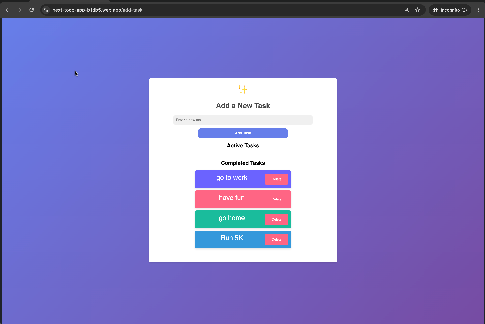

# Next.js Todo App with Firebase

A modern, responsive todo application built with Next.js and Firebase, featuring user authentication and real-time data synchronization.

Check out the live site: [ChexMate Todo App](https://next-todo-app-b1db5.web.app/)

## Features

- User authentication (sign up, sign in, sign out)
- Create, read, update, and delete tasks
- Mark tasks as complete
- Responsive design for mobile, tablet, and desktop
- Real-time updates using Firebase

## Technologies Used

- Next.js 13+
- React
- Firebase (Authentication, Realtime Database, Deploy)
- CSS

## Project Structure

- `src/app`: Next.js app router and page components
- `src/components`: Reusable React components
- `src/firebase`: Firebase configuration and utility functions
- `public`: Static assets

## Contributing

Contributions are welcome! Please feel free to submit a Pull Request.

## License

This project is licensed under the MIT License.
